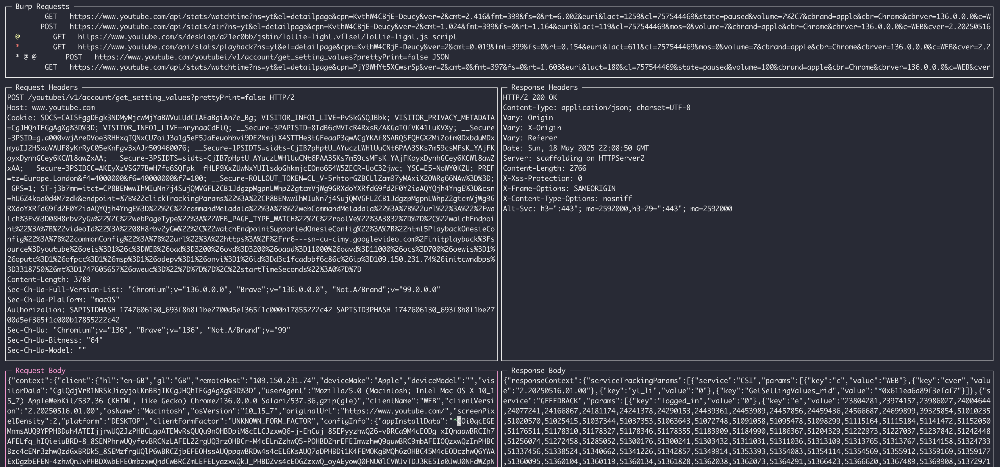

# BRC4 Profile Maker

This is a simple tool to create BRC4 profiles using an interactive TUI. The process of use would tyically be as follows:

1. Start Burp Suite and browse your targets website(s) generating as much traffic as you see fit.
2. Select all the items in the HTTP history and right-click -> "Save Items" -> Save as an XML file.
3. Start the BRC4 Profile Maker and select the Burp Suite proxy as the source of your traffic `-f burp-data.xml`
4. Mark as many requests as you want to include in your profile URLS with `u`
5. Mark the requests you want to append / prepend c2 traffic with `i`. Tab into the request and place cursor in the area you want the badger data to be inserted.
6. Mark the request you want to be used as the empty response with `b`
7. Save the profile with `s`
8. View the finished profile `output.json`

## Help

## Detailed Usage

**Request Marking**
1. You can browse all the requests in the top window by using the arrow up and down keys. You can also apply filters, to filter by method, host, or mimetype.
2. When you find a request that satisfies your needs, you `<tab>` into the request and there you can place your cursor at the location you want brute ratel to split on the prepend / append.
3. Once your cursor is in the place you want to split, you can press `i` to  mark it. This will then place a green `*` at your cursor. To remove it, you can press `i` again.
4. The request will be denoted by a green `@` in the top view, that is has been marked as the Main Request.

**Response Marking**
* Repeat the above process for Response data, by tabbing into the response window and repeating the process with your cursor and the `i` key.
* This allows you to have a different response from the originally chosen request, if you wish.
4. The request will be denoted by a blue `@` in the top view, that is has been marked as the Main Response.

**Empty Response Marking**
* Similar to the process above, however once you have the url selected with the arrow keys, you just press `b` to mark that requests response as the blank response for brute ratel.
4. The request will be denoted by a yellow `@` in the top view, that is has been marked as the Empty Response.

**URL Marking**
* To mark C2 URI's, you simply browse through the requests in the top window and press `u` to mark them. This will place a red `*` next to the request. You can remove it by pressing `u` again. 
* Multiple requests may be marked with a `*`. If URL you have selected is actually called multiple times in your burp data. It will only be added once to the br profile, but you will see repeated `*` in the top view.

**Saving the Profile**
* Once finished, you can save the profile by pressing `s`. This will create a file called `output.json` in the same directory as the script.

## BRC4 Template Profile

We have intentionally removed most settings from the template BR profile that is in `./resources/brc4_template.json`. As a user you would modify this file to have you preferred settings, such as sleep times, stack pivot etc, then you can use the brc4 api to post the generated listener in `output.json` to your server.